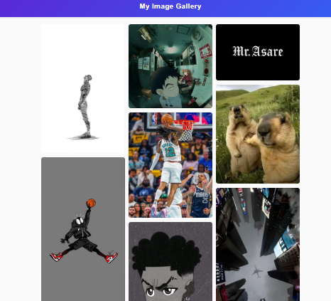

# CodeAlpha Image Gallery

 <!-- Replace with your preferred screenshot -->

## Overview

CodeAlpha is a **responsive image gallery** built with HTML, CSS, and JavaScript.  
It features a masonry layout and a fully interactive lightbox for viewing images in full screen.  

This project demonstrates clean, user-friendly UI design and basic DOM manipulation in JavaScript.

---

## Features

- **Responsive Masonry Grid:** Automatically adapts to screen sizes (desktop, tablet, mobile).  
- **Lightbox Preview:** Click an image t
